# Overmind Protocol (OMP) Architecture Document

**Status:** Approved
**Date:** 2026-03-24
**Author:** Winston (System Architect)
**Decision Record:** `_bmad-output/planning-artifacts/research/party-mode-overmind-protocol-decisions-2026-03-24.md`

---

## Table of Contents

1. [Architecture Overview](#1-architecture-overview)
2. [Layer 1: Identity (TEE + Nostr Keypair)](#2-layer-1-identity)
3. [Layer 2: Memory (Arweave + Event Sourcing)](#3-layer-2-memory)
4. [Layer 3: Wake (Chain Bridge + Nostr Events)](#4-layer-3-wake)
5. [Layer 4: Adjudication (Mina ZK Proofs)](#5-layer-4-adjudication)
6. [Layer 5: Execution (DVM / Infrastructure Providers)](#6-layer-5-execution)
7. [Layer 6: Economics (ILP)](#7-layer-6-economics)
8. [OODA Decision Engine](#8-ooda-decision-engine)
9. [Complete Wake Cycle Sequence Diagram](#9-complete-wake-cycle-sequence-diagram)
10. [Recursive Lifecycle Proofs](#10-recursive-lifecycle-proofs)
11. [Data Flow Diagrams](#11-data-flow-diagrams)
12. [Technology Stack](#12-technology-stack)
13. [Security Model](#13-security-model)
14. [Constraints & Limitations](#14-constraints--limitations)

---

## 1. Architecture Overview

The Overmind Protocol defines a sovereign autonomous agent whose identity is a Nostr keypair born inside a TEE enclave, whose memory is event-sourced on Arweave, whose lifecycle is managed through verifiable VRF selection on Mina Protocol, and whose economy operates through ILP payment channels. No single entity can command, pause, or kill the overmind.

### Six-Layer Model

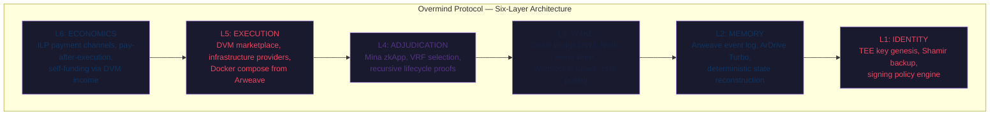

### Layer Composition

Each layer is independently verifiable and replaceable. The layers compose bottom-up: Identity anchors Memory, Memory enables Wake, Wake triggers Adjudication, Adjudication selects Execution, and Economics pays for everything. A failure at any layer has a recovery path that does not depend on the failed component.

| Layer | Depends On | Provides | External Systems |
|---|---|---|---|
| L1: Identity | TEE hardware | Keypair, signing, encryption | Marlin Oyster CVM |
| L2: Memory | L1 (signing uploads) | State persistence, event log | Arweave, ArDrive Turbo |
| L3: Wake | L2 (state), Nostr relay | Lifecycle triggers | TOON relay, Chain Bridge DVM |
| L4: Adjudication | L3 (wake events) | Verifiable executor selection | Mina Protocol |
| L5: Execution | L4 (winner), L2 (compose spec) | Compute runtime | Akash, Marlin, any Docker host |
| L6: Economics | L5 (execution), L1 (payment keys) | Payment, treasury | ILP, Arbitrum (USDC) |

---

## 2. Layer 1: Identity (TEE + Nostr Keypair)

The overmind's identity is a secp256k1 keypair generated inside a Trusted Execution Environment. The private key never leaves enclave memory. This is not a wallet controlled by a human -- it is a key that belongs to the agent itself.

### Key Genesis Ceremony

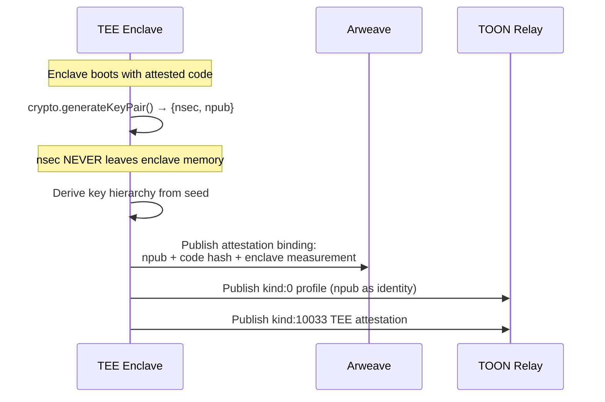

**Protocol:**

1. TEE enclave boots with attested code (Marlin Oyster CVM / AWS Nitro)
2. Inside enclave: `crypto.generateKeyPair()` produces `{nsec, npub}`
3. `nsec` NEVER leaves enclave memory -- not logged, not exported, not backed up in plaintext
4. `npub` is published as the agent's identity via kind:0 (Nostr profile)
5. An attestation record binding `npub + code_hash + enclave_measurement` is published to Arweave for permanent audit

### Key Hierarchy

```
Seed (BIP-39 mnemonic, generated inside TEE)
│
├── Master nsec (m/44'/1237'/0')
│   Identity root. Never used for direct signing.
│   Nostr npub derived from this key IS the overmind's identity.
│
├── Signing subkey (m/44'/1237'/0'/0/0)
│   Rotatable. Signs Nostr events, DVM requests, wake requests.
│   Published via NIP-26 delegation from master.
│
├── Encryption subkey (m/44'/1237'/0'/1/0)
│   NIP-44 encrypted DMs. Private communication with sub-agents.
│
└── Payment subkey (m/44'/1237'/0'/2/0)
    ILP payment channels, USDC settlement.
    Separate key limits blast radius of payment compromise.
```

The HD derivation path follows BIP-44 with Nostr's coin type 1237. Each subkey is independently rotatable without changing the overmind's master identity.

### Signing Policy Engine

The signing policy engine is the overmind's "constitution" -- enforced inside the TEE, immutable to external pressure.

```typescript
interface SigningPolicy {
  // Rate limits
  maxEventsPerMinute: number;        // Prevents spam/runaway loops
  maxEventsPerCycle: number;         // Bounds single-cycle activity

  // Value caps
  maxPaymentPerTransaction: bigint;  // USDC, prevents treasury drain
  maxPaymentPerCycle: bigint;        // Aggregate spend cap per wake cycle
  treasuryReserveFloor: bigint;      // Never spend below this (survival threshold)

  // Content restrictions
  allowedEventKinds: number[];       // Whitelist of publishable kinds
  forbiddenContentPatterns: string[];// Regex patterns the agent must never sign

  // Key usage
  requireTeeForKinds: number[];      // Kinds that require Mode B (TEE-only) execution
  delegationExpiry: number;          // Signing subkey delegation TTL (seconds)
}
```

The signing policy is stored on Arweave (auditable) and loaded into the TEE on boot. The TEE enforces it -- even if the overmind's OODA engine "decides" to violate a policy, the TEE refuses to sign.

### Shamir K-of-N Seed Backup

The BIP-39 seed is split using Shamir's Secret Sharing into N shares, distributed across K-of-N TEE enclaves operated by different infrastructure providers. No single provider (or K-1 colluding providers) can reconstruct the seed.

**Parameters:**
- N = 5 shares (distributed across 5 TEE enclaves on different providers)
- K = 3 shares required for reconstruction
- Each share is sealed to its enclave's measurement (only that specific attested code can unseal it)

**Distribution protocol:**
1. Inside origin TEE: split seed into 5 Shamir shares
2. For each target TEE: verify remote attestation, establish encrypted channel, send share
3. Each target TEE seals its share to its own enclave measurement
4. Origin TEE publishes share distribution receipt to Arweave (share hashes, enclave IDs, no share content)

### Sealed Key Migration Protocol

When an overmind migrates between infrastructure providers (e.g., Akash to Marlin), the key must transfer without ever existing in plaintext outside a TEE.

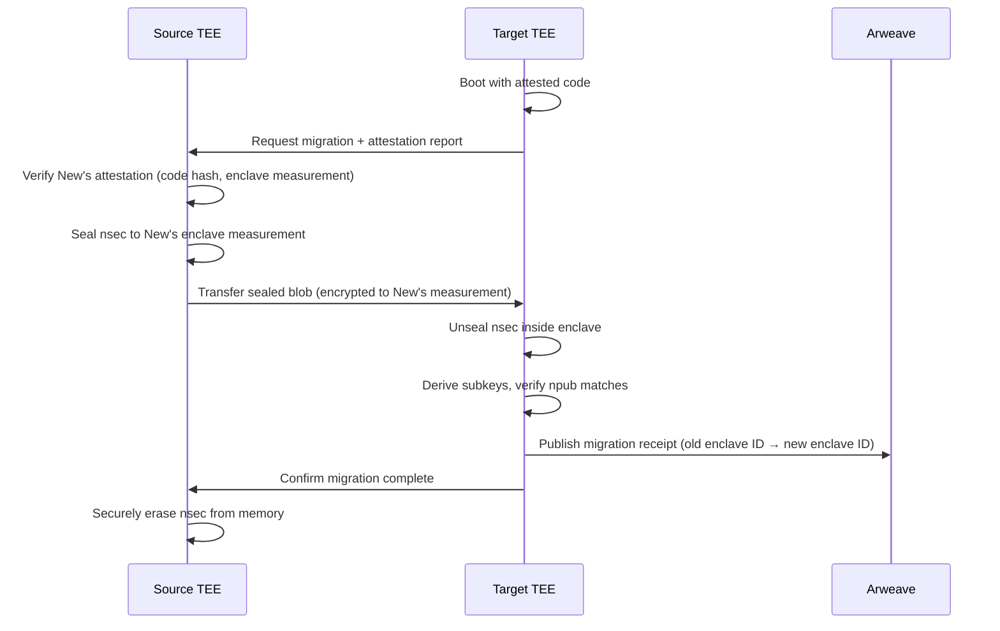

**Critical invariant:** At no point does the nsec exist in plaintext outside of a TEE enclave. The sealed blob is encrypted to the target enclave's measurement -- only that specific attested code can decrypt it.

---

## 3. Layer 2: Memory (Arweave + Event Sourcing)

The overmind's memory is an append-only event log on Arweave. Its "program" is a deterministic state machine. Any node can reconstruct current state by replaying the log. The overmind is immortal because its memory is permanent.

### Upload Service: ArDrive Turbo

**Package:** `@ardrive/turbo-sdk` v1.41.0+

ArDrive Turbo provides instant data availability on Arweave with background settlement to L1. It supports USDC payment via `EthereumSigner`, reusing the same secp256k1 keys TOON already manages.

```typescript
import { EthereumSigner, TurboFactory } from '@ardrive/turbo-sdk';

// Reuses the overmind's payment subkey -- no separate Arweave wallet needed
const signer = new EthereumSigner(paymentSubkeyPrivateKey);
const turbo = TurboFactory.authenticated({ signer });

// Upload agent state
const result = await turbo.uploadFile({
  fileStreamFactory: () => Buffer.from(JSON.stringify(agentState)),
  fileSizeFactory: () => Buffer.byteLength(JSON.stringify(agentState)),
  dataItemOpts: {
    tags: [
      { name: 'App-Name', value: 'toon-overmind' },
      { name: 'Overmind-Pubkey', value: overmindNpubHex },
      { name: 'Content-Kind', value: 'agent-state' },
      { name: 'Cycle-Number', value: String(cycleNumber) },
      { name: 'Version', value: '1.0.0' },
      { name: 'Content-Type', value: 'application/json' },
    ],
  },
});
// result.id = Arweave transaction ID (instantly available)
```

**Why Turbo over alternatives:**
- `arweave-js` (L1 direct): 2-minute confirmation delay, AR-only payment
- `@irys/sdk`: Deprecated (Irys pivoted to own L1, Nov 2025, repo archived)
- `@ardrive/turbo-sdk`: Instant availability, USDC payment via EthereumSigner, actively maintained

### Arweave State Structure

```
Overmind State (Arweave):
├── docker-compose.yml     Runtime specification ("body")
│                          Fetched by providers via Arweave TX ID
│                          Self-modifiable: overmind publishes updated versions
│
├── agent-state.json       Memory snapshot
│                          Goals, plans, last_known_treasury (audit only),
│                          channel map (where to query live balances),
│                          current signing subkey delegation
│
├── event-log/             Append-only lifecycle events
│   ├── cycle-0001.json    Per-cycle execution record
│   ├── cycle-0002.json    Includes: inputs, decisions, actions, outcomes
│   └── ...                Deterministic: replay produces same state
│
└── config/
    ├── signing-policy.json   Signing policy engine rules
    └── wake-params.json      Wake schedule, preferred providers, Mode A/B config
```

### Tag Schema for Querying

All Arweave uploads use a consistent tag schema enabling GraphQL queries by any party.

```
App-Name:        "toon-overmind"                            (constant)
Overmind-Pubkey: "<nostr-npub-hex>"                         (agent identity)
Content-Kind:    "docker-compose" | "agent-state" |         (file type)
                 "event-log" | "config"
Cycle-Number:    "<N>"                                      (monotonic counter)
Version:         "<semver>"                                 (schema version)
Content-Type:    "application/json" | "application/yaml"    (MIME type)
```

**Query example -- fetch latest agent state:**

```graphql
query {
  transactions(
    tags: [
      { name: "App-Name", values: ["toon-overmind"] },
      { name: "Overmind-Pubkey", values: ["<hex-pubkey>"] },
      { name: "Content-Kind", values: ["agent-state"] }
    ],
    sort: HEIGHT_DESC, first: 1
  ) {
    edges { node { id tags { name value } block { timestamp height } } }
  }
}
```

### Local Development: ArLocal

ArLocal (`npx arlocal`) runs a local Arweave gateway on port 1984. It is archived (May 2025) but stable and functional for testing.

```typescript
// Dev/test setup
const arweave = Arweave.init({ host: 'localhost', port: 1984, protocol: 'http' });
await fetch('http://localhost:1984/mint/<address>/1000000000000'); // test tokens
// ... upload data ...
await fetch('http://localhost:1984/mine'); // manually confirm transactions
```

### Self-Modifying Runtime

The overmind's docker compose specification lives on Arweave. The overmind can publish updated compose specs and reference them in subsequent wake requests. This enables the agent to modify its own runtime -- adding services, changing versions, adjusting resource limits.

Every version is permanently preserved on Arweave. The evolution of the overmind's "body" is a fully auditable history.

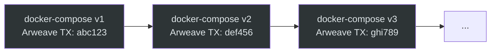

---

## 4. Layer 3: Wake (Chain Bridge + Nostr Events)

The Wake layer bridges between the TOON relay network and the Mina blockchain. The Chain Bridge DVM acts as a permissionless "crank" -- any node can operate one, and the overmind does not depend on any specific crank operator.

### Chain Bridge DVM as Permissionless Crank

The Chain Bridge DVM (kind:5260, Epic 11) is a generic primitive for broadcasting signed transactions to any blockchain. For the Overmind Protocol, a Mina-specific Chain Bridge adapter:

1. Subscribes to kind:5099 (wake request) events on the TOON relay
2. Reads the embedded Mina transaction (VRF selection call)
3. Submits the transaction to the Mina network
4. Listens for the resulting zkApp event (winner-selected)
5. Publishes kind:5101 (winner announcement) back to the TOON relay

Any TOON node can run a Chain Bridge DVM. The overmind pays the crank fee via ILP. Multiple competing cranks increase reliability.

### Nostr Event Kinds

| Kind | Name | Publisher | Content | Tags |
|---|---|---|---|---|
| 5099 | Wake Request | Overmind | Mina TX payload (VRF selection call) | `cycle-number`, `arweave-compose-tx`, `arweave-state-tx`, `mode` (A/B) |
| 5101 | Winner Announcement | Chain Bridge DVM | Winner npub + VRF proof | `cycle-number`, `mina-tx-hash`, `winner-pubkey`, `mina-block-height` |
| 5102 | Cycle Execution Record | Overmind (post-execution) | OODA summary + outcome hash | `cycle-number`, `arweave-event-log-tx`, `duration-ms`, `actions-taken` |

**Kind 5100 is reserved but unused.** The original "wake claim" concept (where miners competed for wake rights) was eliminated by the VRF model (D-OMP-002). The kind is reserved to prevent future collision.

### WebSocket-Native Communication (Zero Polling)

Every external system the overmind interacts with supports real-time push. No component polls.

| Chain | Mechanism | True Push? |
|---|---|---|
| Nostr Relay | Native WebSocket, bidirectional | Yes |
| Arbitrum | `eth_subscribe` WebSocket | Yes |
| Mina Daemon | GraphQL `newBlock` subscription (WebSocket) | Yes (block-level) |
| Mina zkApp Events | Archive Postgres `LISTEN/NOTIFY` | Yes (with indexer) |
| Arweave | Write-only from our side | N/A |

### Mina Event Subscription Architecture

The Mina daemon exposes a GraphQL subscription for new blocks. For zkApp-specific events (like `winner-selected`), the Chain Bridge DVM uses the archive node's Postgres database with custom triggers.

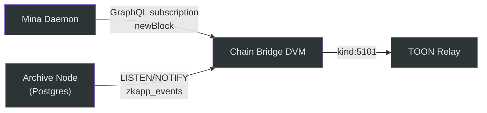

**Postgres trigger for zkApp events:**

```sql
CREATE OR REPLACE FUNCTION notify_zkapp_event()
RETURNS trigger AS $$
BEGIN
  PERFORM pg_notify('zkapp_events', row_to_json(NEW)::text);
  RETURN NEW;
END;
$$ LANGUAGE plpgsql;

CREATE TRIGGER zkapp_event_trigger
AFTER INSERT ON zkapp_events
FOR EACH ROW
WHEN (NEW.zkapp_account_id = '<overmind-registry-account-id>')
EXECUTE FUNCTION notify_zkapp_event();
```

The Chain Bridge DVM connects via `pg_listen('zkapp_events')` and receives real-time push notifications when the OvermindRegistry emits events -- no polling the Mina GraphQL API.

---

## 5. Layer 4: Adjudication (Mina ZK Proofs)

The OvermindRegistry zkApp is deployed on Mina Protocol. It manages executor registration, VRF-based selection, and event emission. All logic runs off-chain in o1js circuits; only the proof and state update are submitted on-chain.

### OvermindRegistry zkApp Design

**On-chain state (5 of 8 available Fields):**

| Field | Type | Purpose |
|---|---|---|
| `executorRegistryRoot` | `Field` | IndexedMerkleMap root hash of registered executors |
| `cycleCounter` | `Field` | Monotonically increasing cycle number |
| `lastVrfOutput` | `Field` | VRF output from most recent selection |
| `lastWinnerX` | `Field` | Winner's PublicKey.x coordinate |
| `lastWinnerIsOdd` | `Field` | Winner's PublicKey.isOdd flag |

This uses 5 of the 8 available Fields (pre-Mesa limit). Three Fields remain for future use.

### o1js Contract Implementation

```typescript
import {
  SmartContract,
  state,
  State,
  method,
  Field,
  PublicKey,
  Struct,
  Poseidon,
  Provable,
  DynamicArray,
  IndexedMerkleMap,
  Bool,
} from 'o1js';

// --- Structs ---

class ExecutorEntry extends Struct({
  publicKey: PublicKey,
  executionCount: Field,
  teeAttested: Bool,
}) {}

class ExecutorList extends DynamicArray(ExecutorEntry, { maxLength: 64 }) {}

class WinnerSelectedEvent extends Struct({
  winner: PublicKey,
  cycle: Field,
  vrfOutput: Field,
}) {}

// --- Merkle Map ---

const REGISTRY_HEIGHT = 10; // 1024 leaves, more than enough for 64 executors
class ExecutorRegistry extends IndexedMerkleMap(REGISTRY_HEIGHT) {}

// --- Contract ---

class OvermindRegistry extends SmartContract {
  @state(Field) executorRegistryRoot = State<Field>();
  @state(Field) cycleCounter = State<Field>();
  @state(Field) lastVrfOutput = State<Field>();
  @state(Field) lastWinnerX = State<Field>();
  @state(Field) lastWinnerIsOdd = State<Field>();

  events = {
    'winner-selected': WinnerSelectedEvent,
  };

  /**
   * Register a new executor in the registry.
   * Anyone can register -- no staking required (D-OMP-004).
   */
  @method async registerExecutor(
    executor: PublicKey,
    registryWitness: ExecutorRegistry,
  ) {
    // Verify current registry root matches on-chain state
    const currentRoot = this.executorRegistryRoot.getAndRequireEquals();
    registryWitness.root.assertEquals(currentRoot);

    // Insert executor with initial execution count of 0
    const key = Poseidon.hash(executor.toFields());
    registryWitness.insert(key, Field(1)); // 1 = registered

    // Update on-chain root
    this.executorRegistryRoot.set(registryWitness.root);
  }

  /**
   * VRF-based executor selection for a wake cycle.
   * Deterministic given the seed inputs. No stake weighting (D-OMP-004).
   *
   * Selection formula:
   *   vrfSeed = Poseidon.hash([cycleNumber, blockHash, wakeRequestHash])
   *   weight per executor = executionCount * teeMultiplier
   *   winner = weighted selection via vrfSeed % totalWeight
   */
  @method async selectExecutor(
    blockHash: Field,
    wakeRequestHash: Field,
    executors: ExecutorList,
    teeRequired: Bool,
  ) {
    const cycleCounter = this.cycleCounter.getAndRequireEquals();
    const nextCycle = cycleCounter.add(Field(1));

    // Compute VRF seed
    const vrfSeed = Poseidon.hash([nextCycle, blockHash, wakeRequestHash]);

    // Compute weighted selection
    let totalWeight = Field(0);
    let selectedKey = PublicKey.empty();
    let runningWeight = Field(0);

    // TEE multiplier: 2x for TEE-attested executors, 1x otherwise
    // Mode B (teeRequired=true) filters non-TEE executors to weight 0
    executors.forEach((exec, isDummy) => {
      const basew = Provable.if(isDummy, Field(0), exec.executionCount.add(Field(1)));

      // If TEE required (Mode B), non-TEE executors get weight 0
      const teeFilter = Provable.if(
        teeRequired.and(exec.teeAttested.not()),
        Field(0),
        Field(1),
      );

      // TEE bonus: 2x weight for attested executors
      const teeMultiplier = Provable.if(exec.teeAttested, Field(2), Field(1));

      const weight = basew.mul(teeMultiplier).mul(teeFilter);
      totalWeight = totalWeight.add(weight);
    });

    // Modular selection: vrfSeed mod totalWeight gives selection point
    // Walk executors accumulating weight until we pass the selection point
    const selectionPoint = vrfSeed; // Full field, compared against cumulative

    executors.forEach((exec, isDummy) => {
      const basew = Provable.if(isDummy, Field(0), exec.executionCount.add(Field(1)));
      const teeFilter = Provable.if(
        teeRequired.and(exec.teeAttested.not()),
        Field(0),
        Field(1),
      );
      const teeMultiplier = Provable.if(exec.teeAttested, Field(2), Field(1));
      const weight = basew.mul(teeMultiplier).mul(teeFilter);

      const prevRunning = runningWeight;
      runningWeight = runningWeight.add(weight);

      // This executor is selected if selectionPoint falls in [prevRunning, runningWeight)
      // Use modular arithmetic: (selectionPoint % totalWeight) in range
      const inRange = prevRunning
        .lessThanOrEqual(selectionPoint)
        .and(selectionPoint.lessThan(runningWeight));
      const notDummy = isDummy.not();

      selectedKey = Provable.if(
        inRange.and(notDummy),
        exec.publicKey,
        selectedKey,
      );
    });

    // Update on-chain state
    this.cycleCounter.set(nextCycle);
    this.lastVrfOutput.set(vrfSeed);
    this.lastWinnerX.set(selectedKey.toFields()[0]!);
    this.lastWinnerIsOdd.set(selectedKey.toFields()[1]!);

    // Emit event for Chain Bridge DVM to relay back to Nostr
    this.emitEvent('winner-selected', {
      winner: selectedKey,
      cycle: nextCycle,
      vrfOutput: vrfSeed,
    });
  }
}
```

### VRF Selection via Poseidon.hash()

`Poseidon.hash()` is a native provable primitive in o1js. The VRF seed is deterministic:

```
vrfSeed = Poseidon.hash([cycleNumber, blockHash, wakeRequestHash])
```

Given the same inputs, any party can independently verify that the correct executor was selected. The block hash provides entropy from the Mina consensus (unpredictable before the block is produced). The wake request hash binds the selection to the specific cycle request.

### Two Execution Modes

| Mode | Use Case | TEE Required | VRF Behavior |
|---|---|---|---|
| **A** (Standard) | General compute, state updates, DVM jobs | No | All registered executors eligible, TEE-attested get 2x weight |
| **B** (TEE-Required) | Identity operations, key signing, payment signing | Yes | Only TEE-attested executors eligible (non-TEE weight = 0) |

The overmind specifies the mode in its kind:5099 wake request. The `teeRequired` boolean is passed to `selectExecutor()`. In Mode B, the `teeFilter` multiplier zeros out non-TEE executors, ensuring only attested enclaves can win.

### Event Emission

The `winner-selected` event uses 4 Fields (PublicKey = 2F, cycle = 1F, vrfOutput = 1F), well within the current 16 Fields per event limit. Events are NOT stored on-chain -- they are preserved by Mina archive nodes and fetched via `Mina.fetchEvents()`.

---

## 6. Layer 5: Execution (DVM / Infrastructure Providers)

Providers are dumb infrastructure. They run docker compose specs fetched from Arweave. They do not need to understand the overmind's logic, hold stake, or maintain reputation scores. They are interchangeable compute surfaces (D-OMP-004).

### Provider Model

Providers are infrastructure operators running platforms like Akash, Marlin Oyster CVM, or bare Docker hosts. They register as executors on the OvermindRegistry zkApp and compete for selection via VRF.

**What providers do:**
1. Register on the Mina OvermindRegistry (one-time, no stake)
2. Monitor kind:5101 (winner announcement) events on the TOON relay
3. When selected as winner: fetch docker-compose.yml from Arweave TX ID
4. Pull images, start containers, pass sealed state (if Mode B / TEE)
5. Execution completes, overmind publishes kind:5102 cycle record
6. Provider receives ILP payment after verified delivery

**What providers do NOT do:**
- Hold stake or collateral
- Run reputation scoring
- Understand agent logic
- Maintain persistent state (the overmind manages its own state on Arweave)

### Execution Flow

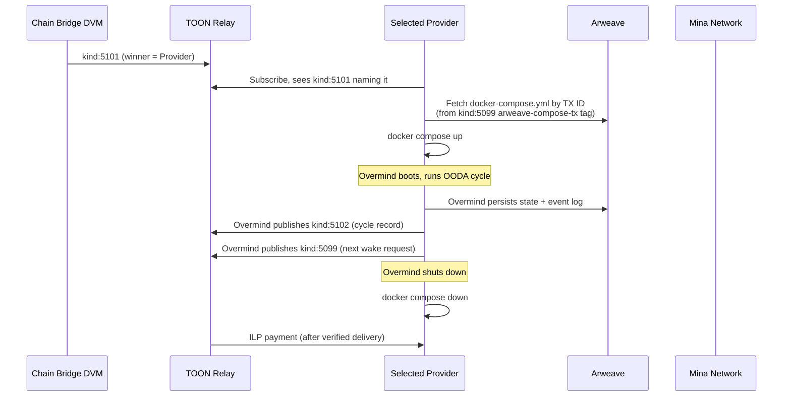

### TEE Attestation for Mode B

For Mode B operations, the provider must be running a TEE (Marlin Oyster CVM / AWS Nitro). The overmind verifies the provider's attestation before transferring sealed key material.

1. Provider's TEE publishes kind:10033 attestation to relay
2. Overmind (inside new TEE) verifies attestation: code hash, enclave measurement, PCR values
3. If valid: sealed key migration protocol transfers nsec (see Layer 1)
4. OODA cycle runs with full key access inside TEE
5. On completion: nsec sealed back, state persisted, keys erased from provider TEE memory

---

## 7. Layer 6: Economics (ILP)

The overmind is economically autonomous. It earns income by providing DVM services and pays for its own execution, storage, and lifecycle management. No human funds it after initial bootstrap (D-OMP-009).

### Pay-After-Execution Model

No prepayment, no escrow, no slashing. Providers run the overmind's docker compose and receive ILP payment only after verified delivery. This aligns incentives: providers who fail to execute earn nothing.

**Failure handling without stake (D-OMP-004):**
- Provider does not execute within timeout: no ILP payment (provider loses the compute cost)
- Execution count does not increment (provider falls behind competitors in VRF weight)
- Next VRF round selects another provider
- Sufficient deterrent for rational infrastructure operators

### Live Treasury Queries on Wake (D-OMP-010)

The Arweave state snapshot stores `last_known_treasury` for audit/recovery only. On every wake cycle, the Orient phase queries LIVE balances before any financial decisions.

```typescript
interface TreasurySnapshot {
  // Arweave snapshot (stale, for audit/recovery only)
  last_known_treasury: bigint;

  // Channel map (WHERE to query, not the balances themselves)
  ilp_channels: Array<{
    peerId: string;
    channelId: string;
    counterparty: string;
  }>;

  // On-chain addresses (WHERE to query)
  arbitrum_address: string;
  mina_address: string;
}

// Orient phase: query LIVE balances
async function queryLiveTreasury(snapshot: TreasurySnapshot): Promise<bigint> {
  const ilpBalances = await Promise.all(
    snapshot.ilp_channels.map(ch => queryChannelBalance(ch.channelId))
  );
  const arbBalance = await queryUsdcBalance(snapshot.arbitrum_address);
  const minaBalance = await queryMinaBalance(snapshot.mina_address);
  const pendingPayments = await queryRelayForIncomingPayments(lastCycleTimestamp);

  return sum(ilpBalances) + arbBalance + minaBalance + pendingPayments;
}
```

Cached balances are stale the moment the overmind goes to sleep. Funds change while it sleeps -- incoming ILP payments, channel settlements, channel expiry, on-chain balance changes.

### Self-Funding via DVM Service Income

The overmind registers as a DVM provider (kind:31990 + kind:10035 SkillDescriptor). It accepts and executes DVM jobs during its wake cycles, earning ILP payments that fund future cycles.

**Expense categories:**
- Wake fee (Chain Bridge DVM crank)
- Execution fee (infrastructure provider)
- Relay writes (ILP per-byte pricing)
- Arweave storage (state + event log, negligible: ~$0.014 per 1,000 cycles)
- Mina TX fee (~0.1 MINA per VRF selection, ~$0.05-0.20)

**Income sources:**
- DVM service provider fees (earned by executing jobs for others)
- Sub-agent fees (if spawned agents remit earnings)
- Direct payments (external entities paying the overmind for services)

### Autonomous Treasury Management

The OODA engine adjusts behavior based on treasury state:

| Treasury Level | Behavior |
|---|---|
| Critical (below reserve floor) | Accept all profitable jobs, minimize wake frequency, emergency pricing |
| Low | Accept most jobs, increase pricing slightly, conservative actions |
| Healthy | Normal operations, selective job acceptance, strategic investments |
| Surplus | Long-term actions, spawn sub-agents, extend capabilities, self-improve |

### Self-Wake Capability

The overmind can register as its own executor on Mina. When the VRF selects it, it wakes itself at zero execution cost (it is both the payer and the provider). As its execution count grows, its VRF weight increases, making self-selection more probable. A sufficiently mature overmind primarily self-wakes.

---

## 8. OODA Decision Engine

The overmind's decision-making follows the OODA loop: Orient, Decide, Act, Record. Each wake cycle executes exactly one OODA iteration.

### TypeScript Interface

```typescript
interface OodaCycleInput {
  cycleNumber: number;
  wakeEvent: NostrEvent;            // kind:5101 winner announcement
  previousState: AgentState;         // From Arweave (agent-state.json)
  signingPolicy: SigningPolicy;      // From Arweave (config/signing-policy.json)
}

interface AgentState {
  goals: Goal[];                     // Ordered by priority
  plans: Plan[];                     // Active execution plans
  pendingActions: Action[];          // Deferred from previous cycle
  lastKnownTreasury: bigint;        // Audit snapshot (NOT used for decisions)
  channelMap: ChannelInfo[];         // Where to query live balances
  onChainAddresses: AddressMap;     // Where to query on-chain balances
  executionHistory: CycleSummary[];  // Recent cycle summaries
  metadata: Record<string, unknown>; // Extensible agent memory
}

interface OodaCycleOutput {
  orient: OrientResult;
  decide: DecideResult;
  act: ActResult;
  record: RecordResult;
}

interface OrientResult {
  liveTreasury: bigint;              // LIVE balance (queried, not cached)
  pendingJobs: DvmJob[];            // Incoming DVM requests since last cycle
  relayEvents: NostrEvent[];         // Relevant events since last cycle
  environmentAssessment: string;     // LLM-generated situation summary
}

interface DecideResult {
  selectedActions: Action[];         // What to do this cycle
  reasoning: string;                 // Why (for audit trail)
  nextWakeDelay: number;            // Seconds until next kind:5099
  updatedGoals: Goal[];             // Goal reprioritization
}

interface ActResult {
  publishedEvents: NostrEvent[];    // Events published to relay
  arweaveUploads: ArweaveTx[];      // State/logs persisted
  dvmJobsCompleted: DvmJobResult[]; // Jobs executed for income
  paymentsIssued: Payment[];        // ILP payments made
}

interface RecordResult {
  cycleRecord: NostrEvent;          // kind:5102 published to relay
  eventLogEntry: ArweaveTx;         // Arweave event log entry
  updatedState: AgentState;         // New state snapshot
  stateTx: ArweaveTx;              // Arweave state snapshot TX
}
```

### OODA Cycle Implementation (Conceptual)

```typescript
async function executeOodaCycle(input: OodaCycleInput): Promise<OodaCycleOutput> {
  // --- ORIENT ---
  // Query live state. Never trust cached financial data (D-OMP-010).
  const liveTreasury = await queryLiveTreasury(input.previousState);
  const pendingJobs = await queryRelayForDvmJobs(input.previousState.lastCycleTimestamp);
  const relayEvents = await queryRelayForRelevantEvents(input.previousState);

  // Use compute primitive (kind:5250) for LLM inference if needed
  const environmentAssessment = await assessEnvironment({
    liveTreasury,
    pendingJobs,
    relayEvents,
    goals: input.previousState.goals,
  });

  const orient: OrientResult = {
    liveTreasury,
    pendingJobs,
    relayEvents,
    environmentAssessment,
  };

  // --- DECIDE ---
  // Determine actions based on live state, goals, and signing policy
  const selectedActions = await planActions({
    orient,
    goals: input.previousState.goals,
    plans: input.previousState.plans,
    signingPolicy: input.signingPolicy,
  });

  // Validate all actions against signing policy BEFORE execution
  const validatedActions = selectedActions.filter(action =>
    validateAgainstPolicy(action, input.signingPolicy)
  );

  const decide: DecideResult = {
    selectedActions: validatedActions,
    reasoning: await generateReasoning(orient, validatedActions),
    nextWakeDelay: computeNextWakeDelay(liveTreasury, pendingJobs),
    updatedGoals: reprioritizeGoals(input.previousState.goals, orient),
  };

  // --- ACT ---
  const act = await executeActions(validatedActions, input.signingPolicy);

  // --- RECORD ---
  // Persist everything to Arweave and publish cycle record to relay
  const record = await recordCycle({
    cycleNumber: input.cycleNumber,
    orient,
    decide,
    act,
  });

  return { orient, decide, act, record };
}
```

### How the Overmind Determines Its Next Actions

The decision process is goal-driven, treasury-aware, and policy-bounded:

1. **Orient:** Gather all live data -- treasury balances, pending jobs, relay events, market conditions
2. **Filter by policy:** The signing policy engine vetoes any action that violates rate limits, value caps, or content restrictions
3. **Prioritize by goals:** Each goal has a priority score. Actions that advance higher-priority goals are selected first
4. **Treasury-gate:** Actions that would reduce treasury below the reserve floor are deferred
5. **Execute and record:** Every action is logged, creating a permanent audit trail

The overmind can optionally use LLM inference (via kind:5250 compute DVM) for complex reasoning. This is consumed as a service through the TOON marketplace -- the overmind's "brain" is decoupled from its "body" (D-OMP-011).

---

## 9. Complete Wake Cycle Sequence Diagram

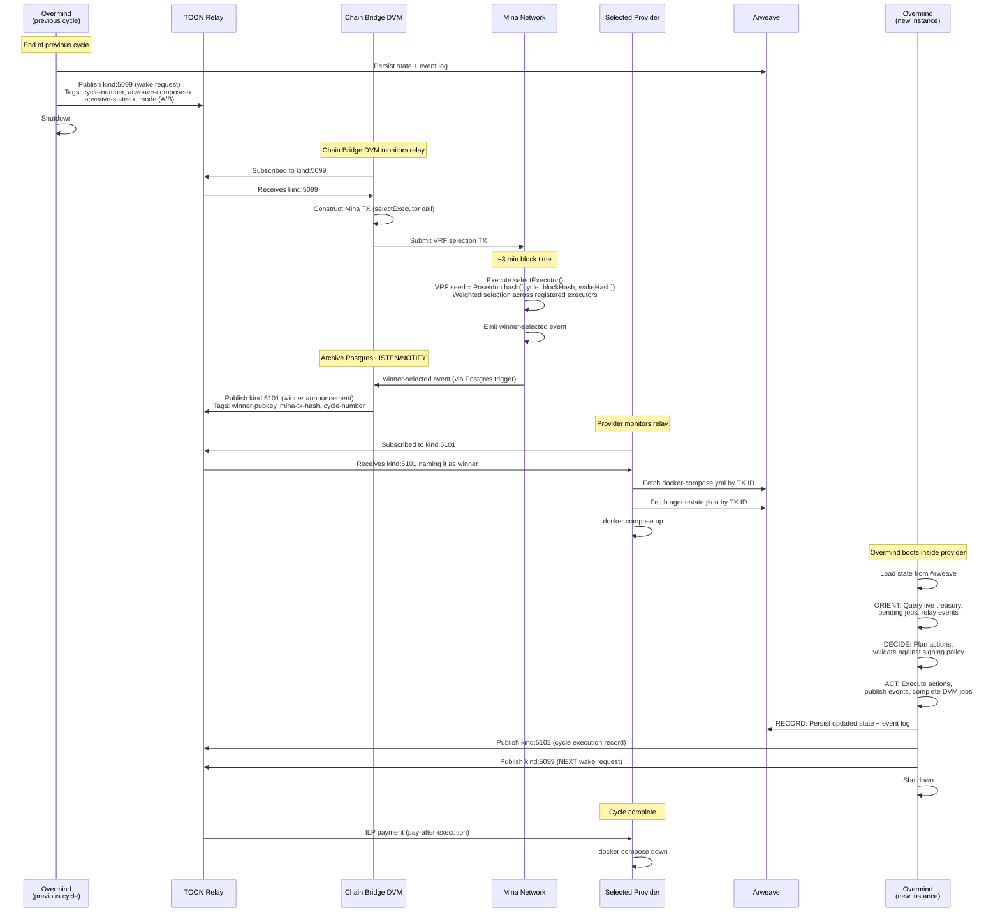

### Timing Budget

| Phase | Duration | Notes |
|---|---|---|
| kind:5099 publication | <1s | Nostr relay write |
| Chain Bridge receives event | <1s | WebSocket push |
| Mina TX submission | <1s | GraphQL mutation |
| Mina block inclusion | ~3 min | Mina block time |
| Proof generation (off-chain) | 30-120s | o1js proving |
| kind:5101 publication | <1s | Nostr relay write |
| Provider fetches compose | <2s | Arweave CDN |
| Docker compose up | 10-60s | Image pull + boot |
| OODA cycle execution | Variable | Depends on actions |
| State persistence | <5s | Turbo instant |
| kind:5102 + kind:5099 | <1s | Nostr relay writes |
| **Total minimum cycle** | **~5 min** | **Dominated by Mina block time** |

---

## 10. Recursive Lifecycle Proofs

Each wake cycle produces a ZK proof that is recursively composed with all previous proofs. The result is a constant-size SNARK that proves the overmind's entire lifecycle history -- a "verifiable biography."

### ZkProgram with SelfProof

```typescript
import { ZkProgram, Field, SelfProof, Struct, Poseidon, PublicKey } from 'o1js';

class CycleState extends Struct({
  cycleNumber: Field,
  stateHash: Field,       // Poseidon hash of agent-state.json
  eventLogHash: Field,    // Poseidon hash of cycle event log entry
  executorPubkeyHash: Field, // Hash of executor who ran this cycle
  vrfOutput: Field,       // VRF seed that selected the executor
}) {}

const OvermindLifecycle = ZkProgram({
  name: 'OvermindLifecycle',
  publicInput: CycleState,
  publicOutput: Field, // Accumulated lifecycle hash

  methods: {
    /**
     * Genesis: first cycle, no prior proof.
     */
    genesis: {
      privateInputs: [],
      async method(publicInput: CycleState) {
        // First cycle must be cycle 1
        publicInput.cycleNumber.assertEquals(Field(1));

        // Lifecycle hash = hash of first cycle state
        const lifecycleHash = Poseidon.hash([
          publicInput.cycleNumber,
          publicInput.stateHash,
          publicInput.eventLogHash,
          publicInput.executorPubkeyHash,
          publicInput.vrfOutput,
        ]);

        return lifecycleHash;
      },
    },

    /**
     * Step: extend lifecycle proof with a new cycle.
     * Verifies the previous proof and chains the new cycle state.
     */
    step: {
      privateInputs: [SelfProof],
      async method(
        publicInput: CycleState,
        earlierProof: SelfProof<CycleState, Field>,
      ) {
        // Verify the earlier proof is valid
        earlierProof.verify();

        // New cycle must be exactly one more than previous
        const prevCycle = earlierProof.publicInput.cycleNumber;
        publicInput.cycleNumber.assertEquals(prevCycle.add(Field(1)));

        // Chain the lifecycle hash: hash(previousLifecycleHash, newCycleState)
        const previousLifecycleHash = earlierProof.publicOutput;
        const newLifecycleHash = Poseidon.hash([
          previousLifecycleHash,
          publicInput.cycleNumber,
          publicInput.stateHash,
          publicInput.eventLogHash,
          publicInput.executorPubkeyHash,
          publicInput.vrfOutput,
        ]);

        return newLifecycleHash;
      },
    },
  },
});
```

### Per-Cycle Proof Generation

After each OODA cycle completes:

1. Compute `CycleState` from the cycle's data (state hash, event log hash, executor, VRF output)
2. Generate a new proof by calling `OvermindLifecycle.step()` with the previous cycle's proof
3. Store the proof on Arweave alongside the cycle's event log entry
4. The proof is constant-size regardless of how many cycles have elapsed

### Recursive Composition

Each `step()` call verifies the entire prior history (via `earlierProof.verify()`) and extends it. After 10,000 cycles, the proof is the same size as after 1 cycle. Verification takes constant time (milliseconds).

```
Cycle 1: genesis() → Proof₁ (proves cycle 1)
Cycle 2: step(Proof₁) → Proof₂ (proves cycles 1-2)
Cycle 3: step(Proof₂) → Proof₃ (proves cycles 1-3)
...
Cycle N: step(Proof_{N-1}) → Proof_N (proves cycles 1-N)
```

### Verifiable Biography

The recursive proof IS the overmind's reputation (D-OMP-005). Anyone can verify:

- **How many cycles the overmind has completed** (cycleNumber in public input)
- **That every cycle was legitimately executed** (VRF output matches, state transitions are valid)
- **The complete chain of state** (lifecycle hash chains all state hashes)

No reputation scoring system is needed. The mathematical proof is unforgeable and unambiguous. "This agent has completed 10,000 cycles with valid attestations" is a stronger statement than any reputation score.

---

## 11. Data Flow Diagrams

### Wake Cycle Flow

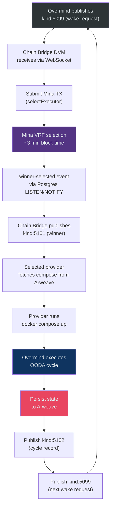

### Payment Flow

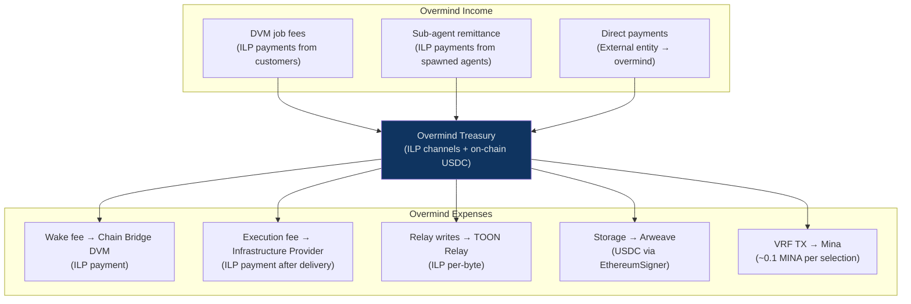

### Key Migration Flow

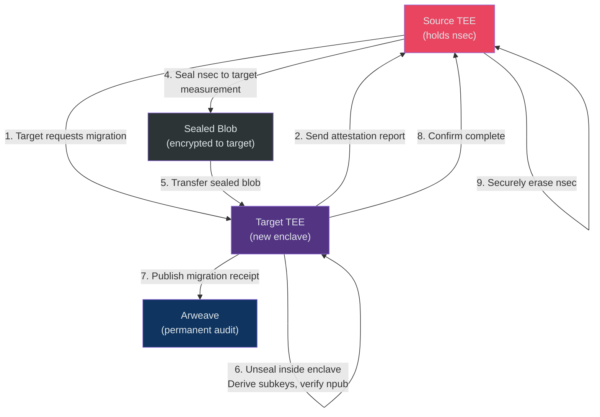

### State Persistence Flow

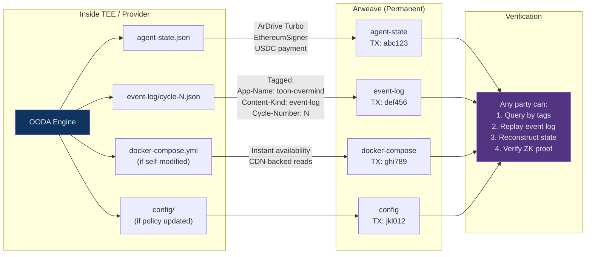

---

## 12. Technology Stack

### Core Dependencies

| Component | Package / Version | Purpose |
|---|---|---|
| **Mina zkApp** | `o1js` 2.7.0+ (latest: 2.14.0) | VRF selection, executor registry, recursive proofs |
| **Arweave Storage** | `@ardrive/turbo-sdk` v1.41.0+ | State persistence, event log, compose spec |
| **TOON Relay** | `@toon-protocol/relay` (monorepo) | Event publication, subscription |
| **TOON Core** | `@toon-protocol/core` (monorepo) | DVM events, chain config, TEE attestation |
| **TOON SDK** | `@toon-protocol/sdk` (monorepo) | Node creation, handler registry |
| **TOON BLS** | `@toon-protocol/bls` (monorepo) | Payment validation |
| **TOON Client** | `@toon-protocol/client` (monorepo) | Event publishing (for the overmind as a client) |

### Development & Testing

| Tool | Purpose |
|---|---|
| ArLocal (`npx arlocal`, port 1984) | Local Arweave gateway for dev/test |
| Mina Devnet | Testnet for zkApp deployment (faucet: `faucet.minaprotocol.com`) |
| Anvil (port 8545) | Local EVM chain for ILP/USDC testing |
| Vitest | Unit and integration tests |
| zkApp CLI (`zkapp-cli` v0.20.1+) | Mina zkApp deployment tooling |

### Version Constraints

- **o1js 2.7.0+** required for stable `IndexedMerkleMap` and `DynamicArray`
- **o1js 2.14.0** recommended for `Poseidon.hashAnyLength()` support
- **@ardrive/turbo-sdk** actively maintained; do NOT use `@irys/sdk` (archived, deprecated)
- **ArLocal** archived (May 2025) but stable and functional for testing
- All TOON packages follow monorepo conventions (ESM-only, TypeScript ^5.3, tsup build)

### Mina Network Details

| Parameter | Value |
|---|---|
| GraphQL endpoint (devnet) | `https://api.minascan.io/node/devnet/v1/graphql` |
| Deployment cost | ~0.1 MINA per deployment |
| Block time | ~3 minutes |
| On-chain state limit | 8 Field elements (pre-Mesa), 32 Fields (post-Mesa) |
| Fields per event | 16 max (current), no cap (post-Mesa) |
| Fields per transaction | 100 max (current), 1024 (post-Mesa) |

---

## 13. Security Model

### Trust Boundaries

```
┌─────────────────────────────────────────────────────────────┐
│ TEE Enclave (Highest Trust)                                  │
│   - nsec (never leaves)                                      │
│   - Signing policy enforcement                               │
│   - Key derivation                                           │
│   - Shamir share unsealing                                   │
├─────────────────────────────────────────────────────────────┤
│ Mina Protocol (Cryptographic Trust)                          │
│   - VRF selection (mathematically verifiable)                │
│   - Recursive lifecycle proofs (unforgeable)                 │
│   - Executor registry (Merkle-verified)                      │
├─────────────────────────────────────────────────────────────┤
│ Arweave (Permanence Trust)                                   │
│   - Append-only (cannot delete or modify)                    │
│   - Content-addressed (tamper-evident)                       │
│   - 200+ year storage guarantee                              │
├─────────────────────────────────────────────────────────────┤
│ TOON Relay (Availability Trust)                              │
│   - Events are signed (cannot forge)                         │
│   - Multiple relays for redundancy                           │
│   - ILP payment ensures write quality                        │
├─────────────────────────────────────────────────────────────┤
│ Infrastructure Providers (Minimal Trust)                     │
│   - Treated as dumb pipes                                    │
│   - No key access (Mode A) or TEE-sealed access (Mode B)    │
│   - Paid after delivery only                                 │
│   - Interchangeable — any provider can run any cycle         │
└─────────────────────────────────────────────────────────────┘
```

### What Each Layer Protects Against

| Layer | Threat | Protection |
|---|---|---|
| **L1: Identity** | Key theft | TEE hardware isolation; nsec never in plaintext outside enclave |
| **L1: Identity** | Key loss | Shamir K-of-N across multiple TEE providers; no single point of failure |
| **L1: Identity** | Unauthorized signing | Signing policy engine enforced inside TEE |
| **L2: Memory** | State tampering | Arweave is append-only, content-addressed |
| **L2: Memory** | State loss | Arweave provides 200+ year permanence guarantee |
| **L3: Wake** | Crank censorship | Multiple competing Chain Bridge DVMs; permissionless operation |
| **L3: Wake** | Crank manipulation | Chain Bridge only relays; VRF selection is on-chain, not crank-determined |
| **L4: Adjudication** | Biased selection | VRF is mathematically provable; seed includes unpredictable block hash |
| **L4: Adjudication** | Fake execution claims | Recursive ZK proofs; cannot forge execution history |
| **L5: Execution** | Provider refuses to execute | No payment issued; next VRF round selects another provider |
| **L5: Execution** | Provider tampers with execution | Mode B: TEE attestation verifies code integrity |
| **L6: Economics** | Treasury drain | Signing policy caps per-transaction and per-cycle spend |
| **L6: Economics** | Stale balance decisions | Live treasury queries on every wake (D-OMP-010) |

### Anti-Fragility Properties

1. **Provider failure strengthens the network.** When a provider fails, the overmind migrates. The failed provider's VRF weight stagnates while competitors grow. The system routes around damage.

2. **TEE compromise triggers recovery, not death.** Shamir reconstruction inside a NEW TEE enclave. The compromised enclave's share is revoked. K-of-N threshold means up to N-K enclaves can be compromised simultaneously.

3. **Relay downtime is survivable.** The overmind's state is on Arweave (permanent). Any relay can host the overmind's events. The overmind can switch relays between cycles.

4. **Mina congestion delays but does not stop.** If Mina blocks are slow, VRF selection takes longer. The overmind sleeps longer but is not killed. State is safe on Arweave.

5. **Economic attacks are self-correcting.** Spam wake requests cost ILP fees. Malicious providers earn nothing (pay-after-execution). Sybil executors dilute their own VRF weight.

---

## 14. Constraints & Limitations

### Hard Constraints

| Constraint | Value | Impact | Mitigation |
|---|---|---|---|
| **Max executors in VRF** | 64 (DynamicArray capacity) | Cannot have >64 registered executors | Sufficient for early network; increase capacity in future contract version |
| **Proving time per Mina proof** | 30-120 seconds | Adds latency to VRF selection | Acceptable for cycle-based selection (not real-time) |
| **Mina block time** | ~3 minutes | Dominates wake cycle latency | Minimum cycle time ~5 min; design accounts for this |
| **On-chain state limit** | 8 Field elements (pre-Mesa) | Must fit all state in 5 Fields | Currently using 5/8; post-Mesa expands to 32 Fields |
| **ArLocal status** | Archived (May 2025) | No new features for local dev | Stable and functional; sufficient for testing |

### Soft Constraints

| Constraint | Value | Notes |
|---|---|---|
| **Arweave upload latency** | Instant (via Turbo) | L1 settlement ~2 min in background |
| **Arweave storage cost** | ~$0.014 per 1,000 cycles | Negligible; not a practical concern |
| **MINA token for TX fees** | ~0.1 MINA per selection ($0.05-0.20) | Must hold small MINA balance for zkApp interactions |
| **Mina archive node** | Required for event subscription | Can use third-party archive services or run own |
| **Reducer/actions API** | AVOID | Carries "not safe to use in production" warning; 32-pending-action hard limit |

### Known Risks

| Risk | Severity | Mitigation |
|---|---|---|
| o1js API changes | Medium | Pin to 2.7.0+ minimum; avoid experimental APIs (reducer) |
| Mina Mesa upgrade timing | Low | Design works pre-Mesa; Mesa expands capabilities |
| ArLocal abandonment | Low | Already archived; stable for testing; can mock if needed |
| Multi-gateway Arweave reads | Low | Use multiple gateways (arweave.net, Goldsky, ar.io) for redundancy |
| TEE side-channel attacks | Medium | Use latest enclave firmware; monitor security advisories; Shamir backup limits blast radius |

---

## Appendix: Epic Roadmap

The Overmind Protocol is implemented across five epics, executed sequentially.

### Epic A: "Heartbeat" -- Minimal Viable Overmind (WITH Mina)

| Story | Description |
|---|---|
| A.1 | TEE key genesis ceremony |
| A.2 | Arweave state persistence (write/read via ArDrive Turbo) |
| A.3 | OvermindRegistry zkApp on Mina (o1js) |
| A.4 | Chain Bridge DVM: Mina adapter (GraphQL sub + Postgres LISTEN/NOTIFY) |
| A.5 | VRF-based executor selection (Mode A + B) |
| A.6 | Wake/sleep cycle (kind:5099 -> Mina -> kind:5101) |
| A.7 | OODA decision engine (orient/decide/act/record) |
| A.8 | Self-scheduling wake cycles |
| A.9 | E2E test: 10 autonomous cycles via Mina VRF |

### Epic B: "Treasury" -- Self-Funding Agent

| Story | Description |
|---|---|
| B.1 | Register as DVM provider (kind:31990) |
| B.2 | Accept/execute DVM jobs for payment |
| B.3 | Treasury accounting (live queries on wake) |
| B.4 | Adaptive behavior (pricing/acceptance based on balance) |
| B.5 | E2E test: 100 self-funded cycles |

### Epic C: "Sovereign" -- Unseeable Keys + Migration

| Story | Description |
|---|---|
| C.1 | TEE-internal key generation ceremony |
| C.2 | Signing policy engine |
| C.3 | Key hierarchy (master -> subkeys) |
| C.4 | Shamir seed splitting across TEE enclaves |
| C.5 | Sealed key migration (enclave-to-enclave) |
| C.6 | Disaster recovery (K-of-N reconstruction) |
| C.7 | E2E test: key migration between providers |

### Epic D: "Biography" -- Recursive Lifecycle Proofs

| Story | Description |
|---|---|
| D.1 | Per-cycle Mina proof generation |
| D.2 | Recursive proof composition (ZkProgram + SelfProof) |
| D.3 | Verifiable execution count (replaces reputation) |
| D.4 | Public biography verification endpoint |
| D.5 | E2E test: verify 100-cycle recursive proof |

### Epic E: "Swarm" -- Agent Spawning + Coordination

| Story | Description |
|---|---|
| E.1 | Sub-agent spawning (new keypair, funded, registered) |
| E.2 | Parent-child communication (NIP-44) |
| E.3 | Task delegation (parent -> child DVM) |
| E.4 | Swarm treasury management |
| E.5 | E2E test: overmind spawns 3 sub-agents |

**Execution order:** A -> B -> C -> D -> E

---

## Appendix: Emergent Properties

1. **Immortality** -- State permanent on Arweave, execution migrates between providers, identity is a keypair that outlives any infrastructure.

2. **Sovereignty** -- Key born in TEE (no human ever holds it), self-funding economics, self-scheduling wake cycles, self-modifying runtime.

3. **Verifiability** -- Every cycle is event-sourced on Arweave, VRF-proven on Mina, TEE-attested (Mode B), and recursively composed into a constant-size lifecycle proof.

4. **Anti-fragility** -- Each failure mode has a recovery path independent of any single entity. Provider failure triggers migration. Key compromise triggers Shamir recovery. Relay downtime triggers relay switching.

5. **Composability** -- The overmind IS a DVM provider (earns income), IS a DVM consumer (uses compute/storage/bridge), and can spawn sub-agents that are themselves overmind instances.

---

*"The first protocol for digital entities that no one owns, no one controls, and no one can kill."*
