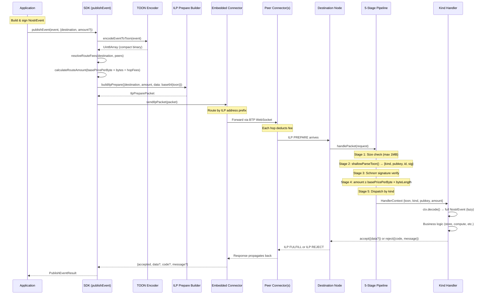
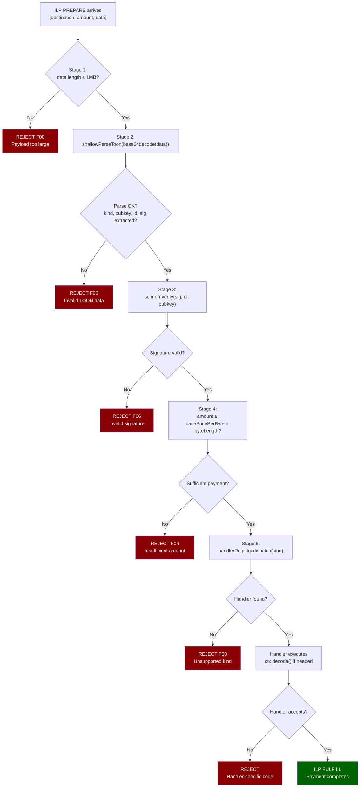
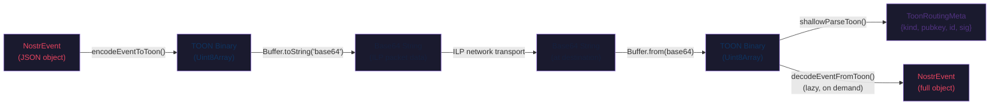

# ILP Packet Flow

How a TOON event travels from sender to receiver through the ILP network.

## Sequence Diagram — Full Packet Lifecycle

## Flowchart — 5-Stage Pipeline Detail

## Data Format Transformations

