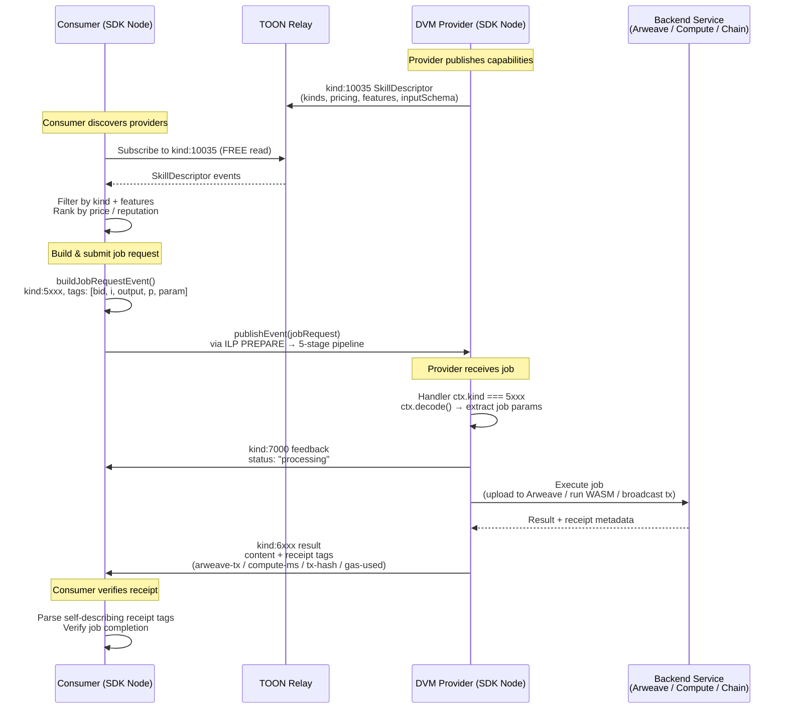
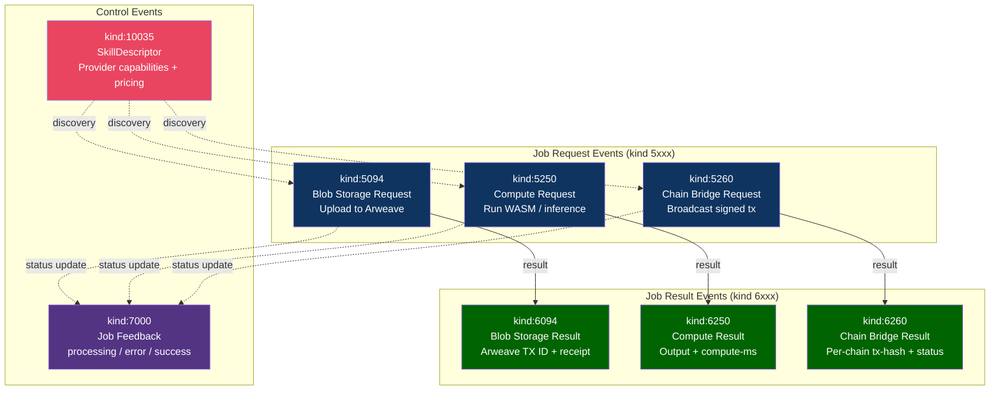
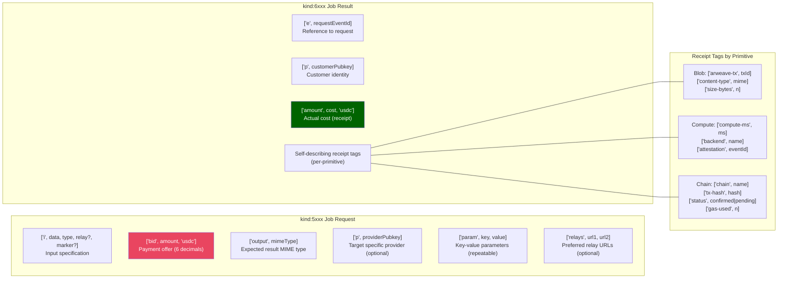
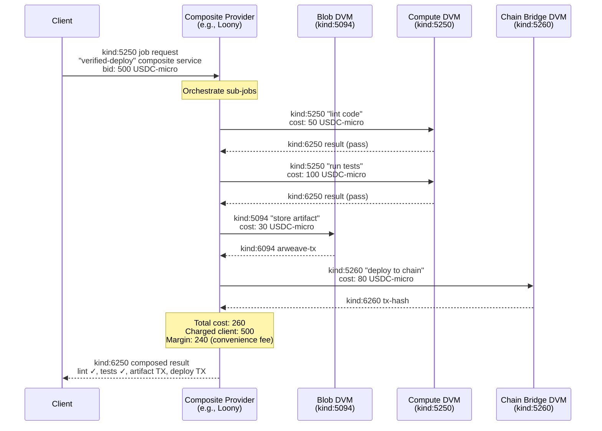

# DVM (Data Vending Machine) Flow

How consumers discover providers, submit jobs, and receive results — all paid via ILP.

## Sequence Diagram — Complete DVM Job Lifecycle

## Flowchart — DVM Event Kind Taxonomy

## Flowchart — DVM Job Request Tag Structure

## Sequence Diagram — Multi-Primitive Composition (Workflow)

