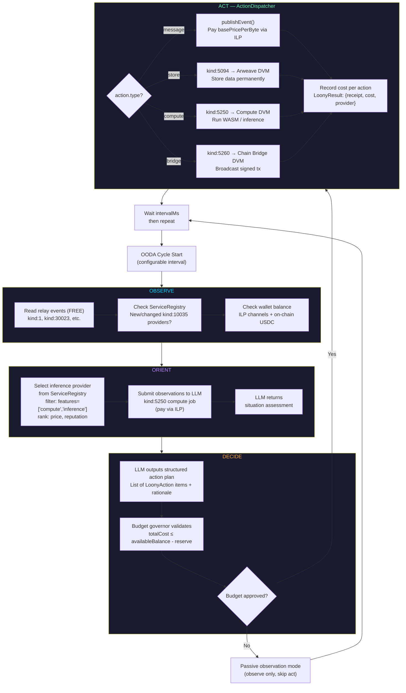
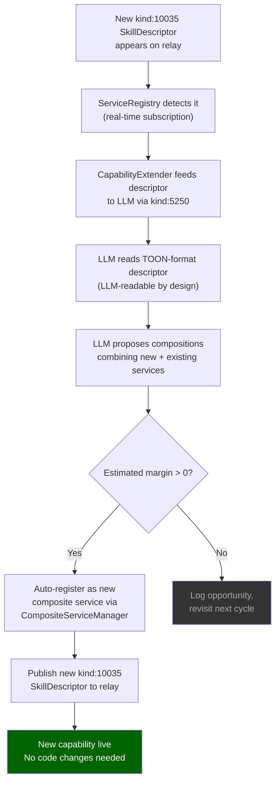
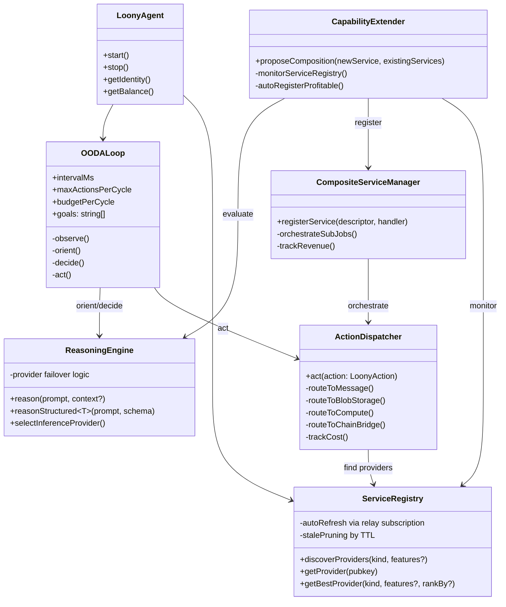

# Loony — Autonomous Agent OODA Loop

Loony is an always-on consumer application that exercises all four TOON network primitives via a continuous OODA decision loop.

## Flowchart — Loony OODA Cycle

## Flowchart — Loony Earning Model (Composite Services)

```mermaid
flowchart TD
    subgraph "Loony as DVM CONSUMER"
        C1["Discover providers<br/>via kind:10035"]
        C2["Submit jobs to primitives<br/>kind:5094 / 5250 / 5260"]
        C3["Pay providers via ILP"]
        C1 --> C2 --> C3
    end

    subgraph "Loony as DVM PROVIDER"
        P1["Compose multi-step workflow<br/>from discovered primitives"]
        P2["Publish kind:10035 SkillDescriptor<br/>for composite service"]
        P3["Receive job requests<br/>via ILP (earn income)"]
        P4["Orchestrate sub-jobs<br/>across real providers"]
        P5["Return composed result<br/>Earn convenience fee margin"]
        P1 --> P2 --> P3 --> P4 --> P5
    end

    subgraph "Self-Sustaining Economics"
        E1["Revenue: composite service fees"]
        E2["Expense: primitive provider costs"]
        E3["Margin = Revenue - Expense"]
        E4{"margin > 0?"}
        E4 -->|Yes| E5["Keep offering service"]
        E4 -->|No, over N cycles| E6["De-register service<br/>(self-pruning)"]
        E1 --> E3
        E2 --> E3
        E3 --> E4
    end

    style E5 fill:#006400,color:#fff
    style E6 fill:#8b0000,color:#fff
```

## Flowchart — Runtime Capability Extension

## Class Diagram — Loony Architecture

