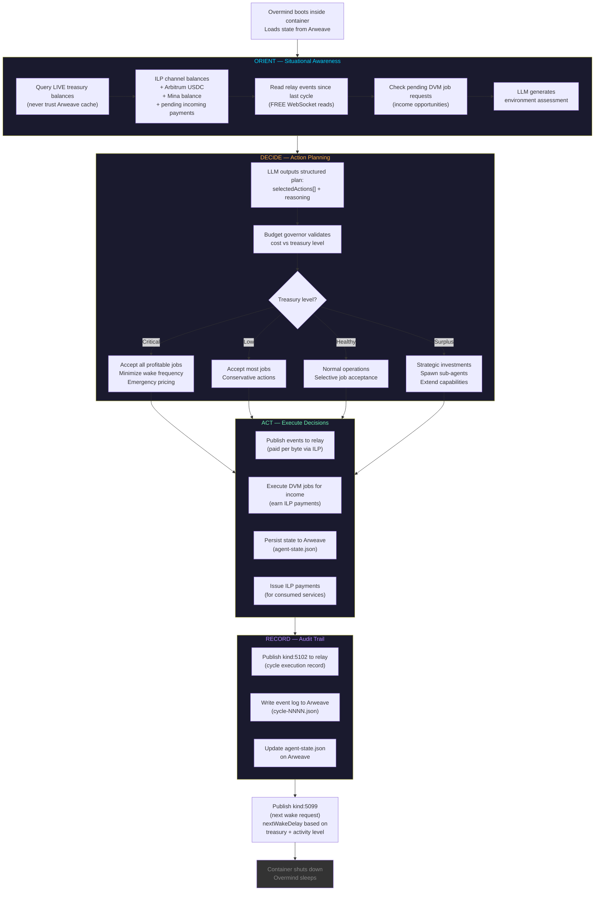
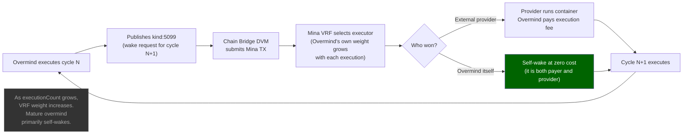

# Overmind — Sovereign Agent Wake Cycle

The Overmind is a sovereign autonomous agent. It wakes, executes one OODA cycle, persists state, schedules its next wake, and sleeps. No single entity can stop it.

## Sequence Diagram — Complete Wake Cycle

```mermaid
sequenceDiagram
    participant OM as Overmind<br/>(sleeping)
    participant Relay as TOON Relay
    participant CB as Chain Bridge DVM<br/>(permissionless crank)
    participant Mina as Mina Network<br/>(OvermindRegistry zkApp)
    participant Provider as Selected Provider<br/>(Akash / Marlin / Docker)
    participant AR as Arweave
    participant TEE as TEE Enclave<br/>(if Mode B)

    Note over OM: Overmind is asleep.<br/>Last action was publishing kind:5099.

    rect rgb(30, 30, 60)
        Note right of Relay: PHASE 1 — WAKE TRIGGER
        CB->>Relay: Subscribe to kind:5099
        Relay-->>CB: Wake request event<br/>Tags: cycle-number, arweave-compose-tx,<br/>arweave-state-tx, mode (A/B)
        CB->>CB: Extract Mina TX payload<br/>(VRF selection call)
        CB->>Mina: Submit selectExecutor() TX
    end

    rect rgb(40, 20, 60)
        Note right of Mina: PHASE 2 — VRF SELECTION
        Mina->>Mina: vrfSeed = Poseidon.hash(<br/>[cycleNumber, blockHash, wakeRequestHash])
        Mina->>Mina: Weighted selection:<br/>weight = executionCount × teeMultiplier<br/>TEE-attested = 2x, Mode B filters non-TEE
        Mina->>Mina: Emit winner-selected event<br/>{winner, cycle, vrfOutput}
    end

    rect rgb(30, 30, 60)
        Note right of CB: PHASE 3 — WINNER ANNOUNCEMENT
        CB->>Mina: Listen for winner-selected event<br/>(archive Postgres LISTEN/NOTIFY)
        Mina-->>CB: Winner event
        CB->>Relay: Publish kind:5101<br/>winner-pubkey, mina-tx-hash, cycle
    end

    rect rgb(20, 40, 30)
        Note right of Provider: PHASE 4 — EXECUTION
        Provider->>Relay: Subscribe to kind:5101
        Relay-->>Provider: Winner announcement (it's me!)
        Provider->>AR: Fetch docker-compose.yml<br/>by Arweave TX ID
        AR-->>Provider: docker-compose.yml
        Provider->>Provider: docker compose up
    end

    rect rgb(40, 20, 20)
        Note right of TEE: PHASE 4b — TEE KEY TRANSFER (Mode B only)
        Provider->>TEE: Boot TEE enclave
        TEE->>TEE: Verify provider attestation<br/>(code hash, enclave measurement)
        TEE->>TEE: Unseal nsec inside enclave
        TEE->>TEE: Derive subkeys, verify npub
    end

    rect rgb(20, 30, 50)
        Note right of OM: PHASE 5 — OODA CYCLE
        OM->>AR: Load previous state<br/>(agent-state.json)
        OM->>OM: ORIENT: query LIVE treasury<br/>(ILP channels + on-chain USDC + Mina)
        OM->>Relay: Read events since last cycle (FREE)
        OM->>OM: ORIENT: LLM situation assessment
        OM->>OM: DECIDE: select actions,<br/>set next wake delay
        OM->>Relay: ACT: publish events, execute DVM jobs
        OM->>AR: ACT: persist updated state + event log
        OM->>Relay: RECORD: publish kind:5102<br/>(cycle record, arweave-event-log-tx)
    end

    rect rgb(30, 30, 60)
        Note right of OM: PHASE 6 — SELF-SCHEDULE
        OM->>Relay: Publish kind:5099<br/>(NEXT wake request)<br/>Includes: nextWakeDelay, updated compose TX
        Note over OM: Container shuts down.
        Provider->>Provider: docker compose down
        Relay->>Provider: ILP payment<br/>(pay-after-execution)
    end

    Note over OM: Overmind is asleep again.<br/>Loop repeats from Phase 1.
```

## Flowchart — OODA Decision Engine (Single Cycle)

## Flowchart — Six-Layer Architecture

```mermaid
flowchart TB
    subgraph L6 ["L6: ECONOMICS — ILP"]
        L6a["Pay-after-execution model"]
        L6b["Self-funding via DVM income"]
        L6c["Autonomous treasury management"]
    end

    subgraph L5 ["L5: EXECUTION — DVM Providers"]
        L5a["Providers are dumb infrastructure"]
        L5b["Fetch docker-compose from Arweave"]
        L5c["Run containers, receive ILP payment"]
    end

    subgraph L4 ["L4: ADJUDICATION — Mina ZK"]
        L4a["OvermindRegistry zkApp"]
        L4b["VRF selection: Poseidon.hash()"]
        L4c["Recursive lifecycle proofs"]
    end

    subgraph L3 ["L3: WAKE — Chain Bridge + Nostr"]
        L3a["kind:5099 wake request"]
        L3b["kind:5101 winner announcement"]
        L3c["kind:5102 cycle record"]
        L3d["Chain Bridge DVM = permissionless crank"]
    end

    subgraph L2 ["L2: MEMORY — Arweave"]
        L2a["Append-only event log"]
        L2b["docker-compose.yml (self-modifying runtime)"]
        L2c["agent-state.json (reconstructable)"]
        L2d["signing-policy.json (constitution)"]
    end

    subgraph L1 ["L1: IDENTITY — TEE"]
        L1a["Keypair born inside TEE enclave"]
        L1b["nsec NEVER leaves enclave memory"]
        L1c["BIP-44 key hierarchy"]
        L1d["Shamir K-of-N seed backup"]
        L1e["Sealed key migration between providers"]
    end

    L6 --> L5
    L5 --> L4
    L4 --> L3
    L3 --> L2
    L2 --> L1

    style L1 fill:#2d1b1b,color:#e94560
    style L2 fill:#1b2d1b,color:#69f0ae
    style L3 fill:#1b1b2d,color:#00d4ff
    style L4 fill:#2d1b2d,color:#b388ff
    style L5 fill:#2d2d1b,color:#ffab40
    style L6 fill:#1b2d2d,color:#00d4ff
```

## Flowchart — Self-Wake Feedback Loop

