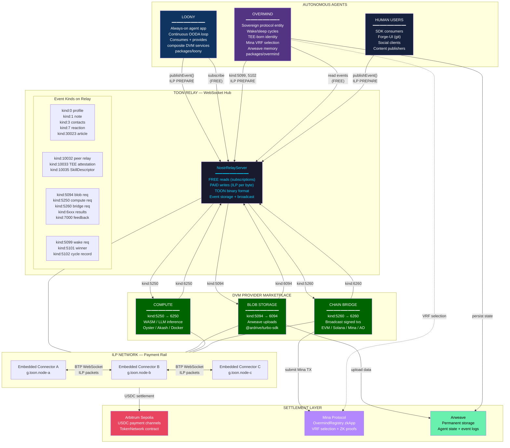
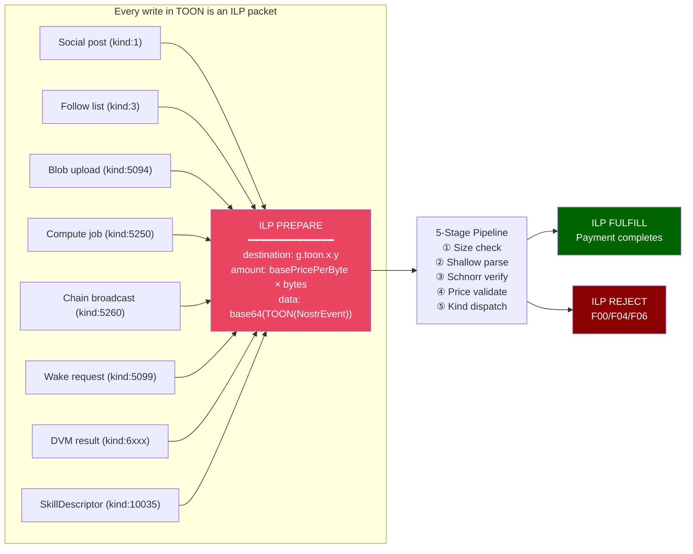
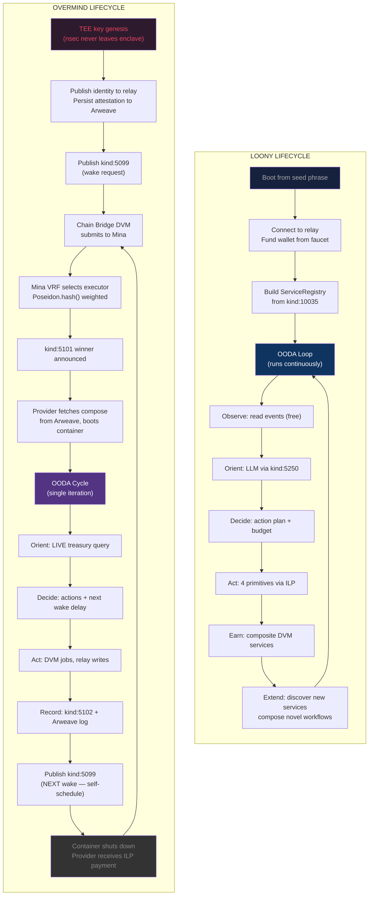
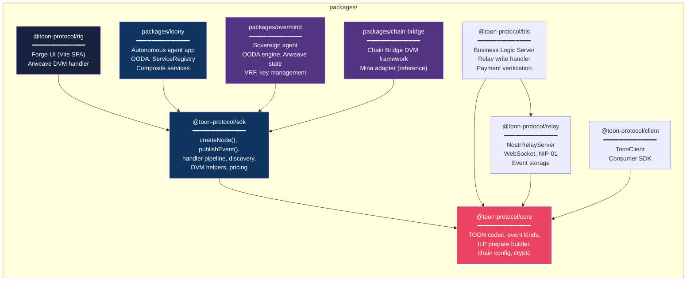
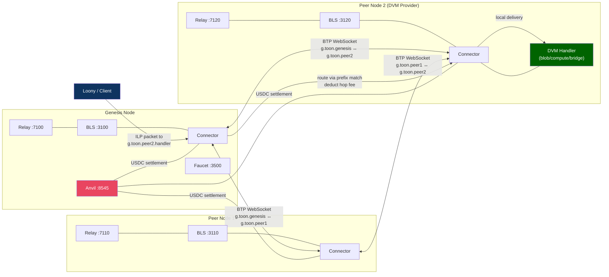

# TOON Protocol — Unified Protocol Map

Where ILP packets, DVMs, relays, Loony, and Overmind all sit in the protocol and how they connect.

## The Big Picture — Full Protocol Architecture

## The ILP Packet as Universal Carrier

## Loony vs Overmind — Side-by-Side Lifecycle

## Component Dependency Map

## Network Topology — Multi-Node ILP Routing

