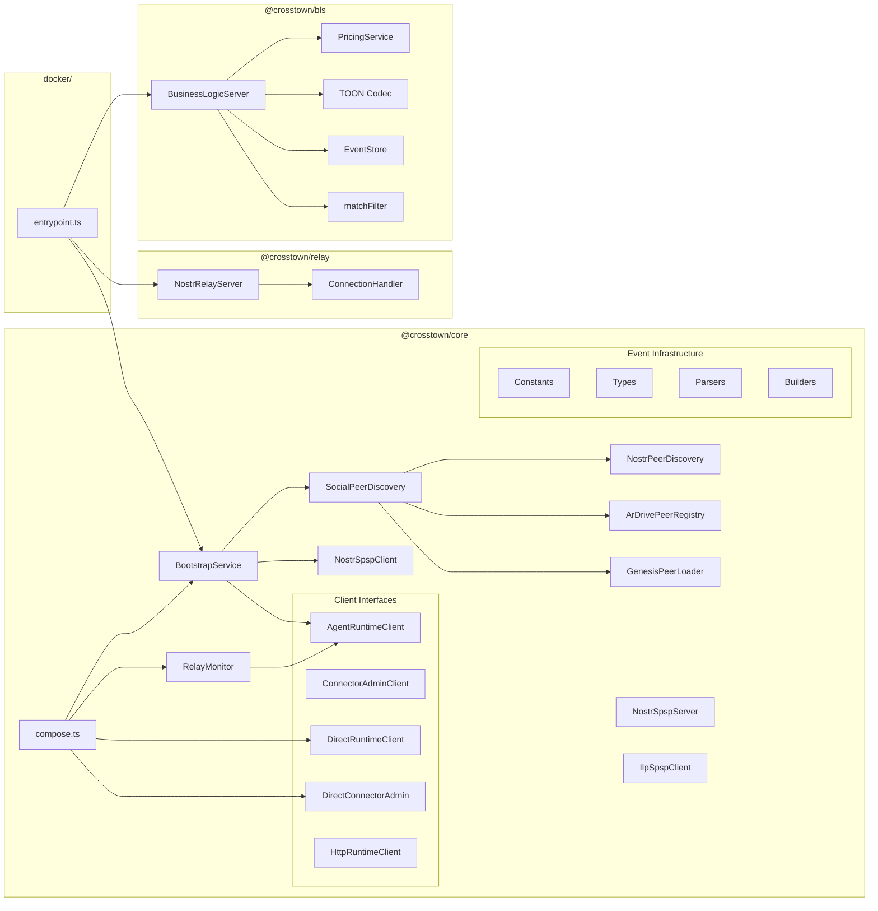

# 5. Components

## 5.1 @crosstown/core

**Responsibility:** Main protocol library providing peer discovery, SPSP exchange, trust calculation, bootstrap orchestration, and embedded connector composition.

**Key Modules:**

- `bootstrap/` - BootstrapService (multi-phase lifecycle), RelayMonitor (real-time kind:10032 monitoring), AgentRuntimeClient/ConnectorAdminClient interfaces, direct and HTTP client implementations
- `discovery/` - SocialPeerDiscovery (layered: genesis → ArDrive → NIP-02), NostrPeerDiscovery, ArDrivePeerRegistry, GenesisPeerLoader
- `spsp/` - NostrSpspClient, NostrSpspServer, IlpSpspClient (ILP-first SPSP), settlement negotiation, channel opening
- `events/` - Parsers, builders, constants for all event kinds
- `compose.ts` - `createCrosstownNode()` composition function

**Dependencies:** nostr-tools

## 5.2 @crosstown/bls

**Responsibility:** Standalone Business Logic Server for ILP payment verification, TOON decoding, event pricing, and storage. Extracted from relay as a reusable package for both relay and Docker deployments.

**Key Modules:**

- `bls/` - BusinessLogicServer (handlePacket), types (HandlePacketRequest/Response)
- `pricing/` - PricingService (per-kind pricing), config loading (env vars, file-based)
- `storage/` - EventStore interface, InMemoryEventStore, SqliteEventStore
- `filters/` - NIP-01 filter matching (matchFilter)
- `toon/` - TOON encoder/decoder for Nostr event ↔ ILP packet data

**Dependencies:** better-sqlite3, Hono, @toon-format/toon

## 5.3 @crosstown/relay

**Responsibility:** Reference implementation of ILP-gated Nostr relay with NIP-01 WebSocket server.

**Key Modules:**

- `websocket/` - NostrRelayServer, ConnectionHandler (NIP-01 REQ/EVENT/CLOSE)
- `subscriber/` - RelaySubscriber (upstream relay event propagation)
- `bls/` - BusinessLogicServer (relay-specific BLS wrapping)
- `pricing/` - PricingService (relay pricing config)
- `storage/` - InMemoryEventStore, SqliteEventStore
- `toon/` - TOON encoder/decoder
- `filters/` - NIP-01 filter matching

**Dependencies:** ws, better-sqlite3, Hono

## 5.4 @crosstown/examples

**Responsibility:** Integration examples demonstrating library usage.

**Key Interfaces:**

- `ilp-gated-relay-demo/` - Full relay demo with agent, relay, and mock connector

**Dependencies:** @crosstown/core, @crosstown/bls

## 5.5 docker/

**Responsibility:** Standalone Docker entrypoint that wires BLS + relay + bootstrap into a deployable container.

**Key Files:**

- `src/entrypoint.ts` - Main entrypoint: config loading, BLS server start, SPSP server start, bootstrap orchestration
- `Dockerfile` - Container build

**Dependencies:** @crosstown/core, @crosstown/bls, @crosstown/relay

## 5.6 packages/agent/ (Planned — Epic 11)

**Responsibility:** Autonomous TypeScript runtime using Vercel AI SDK (v6) that subscribes to Nostr relays, routes events by kind to LLM-powered handlers, and executes structured actions back to relays.

**Planned Modules:**

- Kind Registry + Handler Loader (markdown handler references → system prompts)
- Zod action schemas with per-kind allowlists
- Core handler function (`handleNostrEvent()`) with structured output
- Action Executor (action JSON → relay publish)
- Security defense stack (content isolation, datamarkers, rate limiting, audit log)
- Multi-model provider registry (Anthropic, OpenAI, Ollama)

**Planned Dependencies:** ai (Vercel AI SDK v6), @ai-sdk/anthropic, zod, nostr-tools

## 5.7 Component Diagram

---
